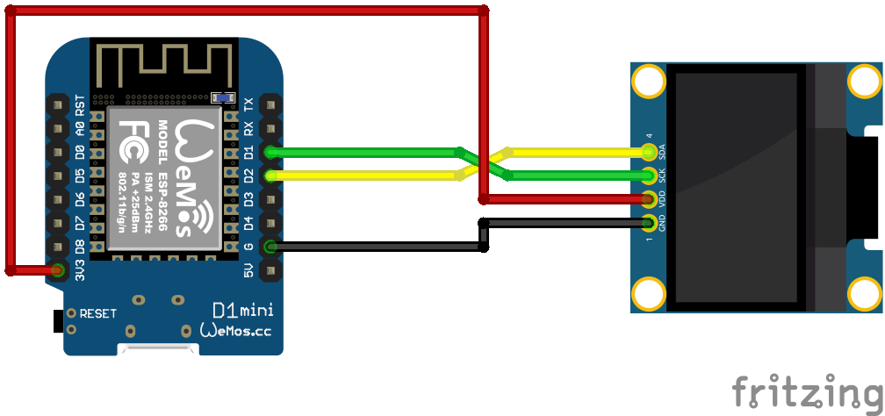

# SSD1306 Display
Auf Basis von [ESPHome](https://esphome.io/)

## Schaltplan


## Beispiel ausführen
```bash
esphome run ssd1306.yaml
```
## Kauflink
* [AZDelivery](https://www.azdelivery.de/products/0-96zolldisplay)
 * [Amazon](https://www.amazon.de/AZDelivery-Display-Arduino-Raspberry-gratis/dp/B01L9GC470)
 * [Aliexpress](https://de.aliexpress.com/item/32638662748.html)


## Dokumentation
[ESPHome SSD1306](https://esphome.io/components/display/ssd1306.html)