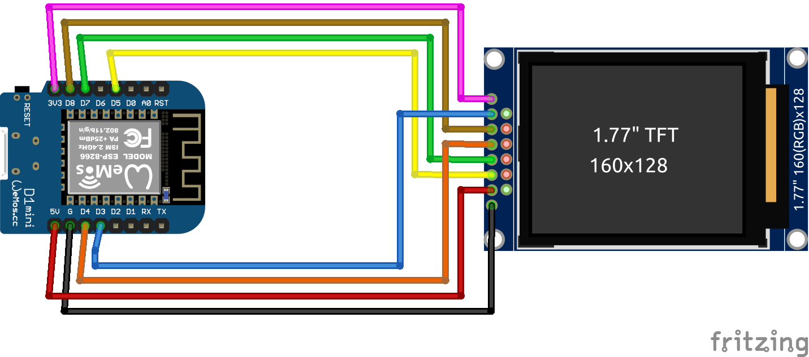

# ST7735 Display
Auf Basis von [ESPHome](https://esphome.io/)

## Schaltplan


## Beispiel ausführen
```bash
esphome run st7735.yaml
```
## Kauflink
* [AZDelivery](https://www.az-delivery.de/products/1-77-zoll-spi-tft-display)
 * [Amazon](https://www.amazon.de/AZDelivery-TFT-Display-128x160-Pixeln-gratis/dp/B078JBBPXK)
 * [Aliexpress](https://de.aliexpress.com/item/32947890530.html)


## Dokumentation
[ESPHome ST7735](https://esphome.io/components/display/st7735.html)