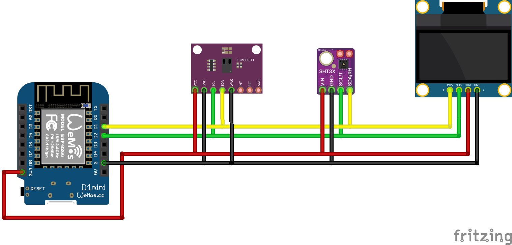

# Airmonitor
Ein Luftqualität, Temperatur und Luftfeuchtigkeitsmesser mit 3D gedruckten Gehäuse
## Teile
 * Wemos D1 mini
 * [SHT30](../../sensors/sht30)
 * [CCS811](../../sensors/ccs811)
 * [0.96 OLED Display](../../displays/ssd1306)

## Schaltplan

## Setup
Die secrets.yaml.example nach secrets.yaml kopieren. Mit den gewünschten Werten befüllen. Anschließend ausführen:
```bash
esphome run airmoitor.yaml
```

## Gehäuse
https://www.thingiverse.com/thing:4738646