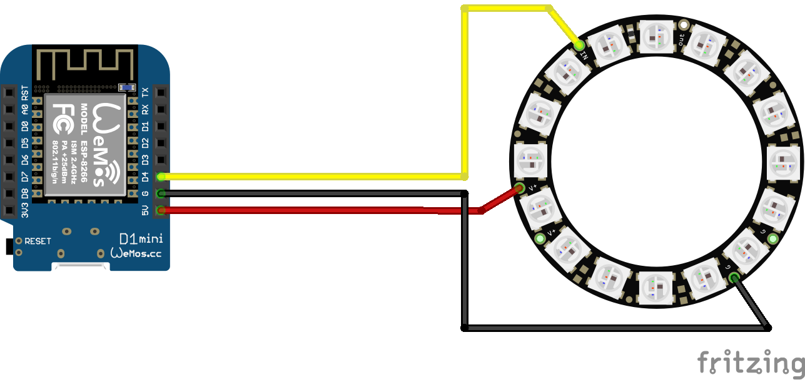

# Crystallight
Ein RGB-Licht zum beleuchten von zb einem Kristall

## Teile
  * Wemos D1 mini
  * [WS2812B Ring](https://www.amazon.de/gp/product/B01NBC5CTH)

## Schaltplan

## Gehäuse
  * [Thingiverse](https://www.thingiverse.com/thing:4901540/files)