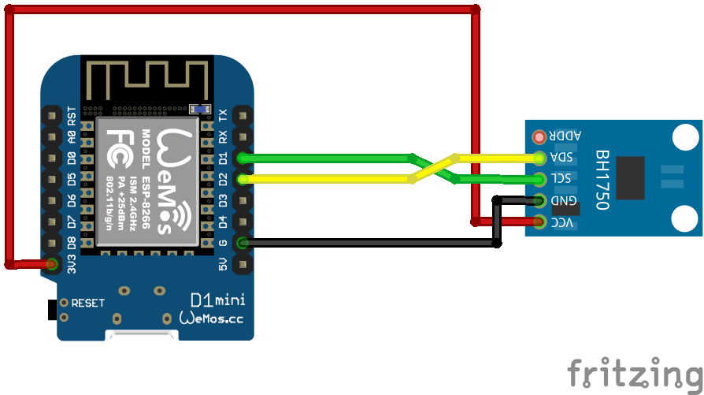

# BH1750 Sensor
Auf Basis von [ESPHome](https://esphome.io/)

## Schaltplan


## Beispiel ausführen
```bash
esphome run bh1750.yaml
```
## Kauflink
* [AZDelivery](https://www.az-delivery.de/products/gy-302-bh1750-lichtsensor-lichtstaerke-modul-fuer-arduino-und-raspberry-pi)
 * [Amazon](https://www.amazon.de/AZDelivery-GY-302-Helligkeitsensor-Arduino-Raspberry/dp/B07NLL4SCB)
 * [Aliexpress](https://de.aliexpress.com/item/32859303675.html)


## Dokumentation
[ESPHome BH1750](https://esphome.io/components/sensor/bh1750.html)