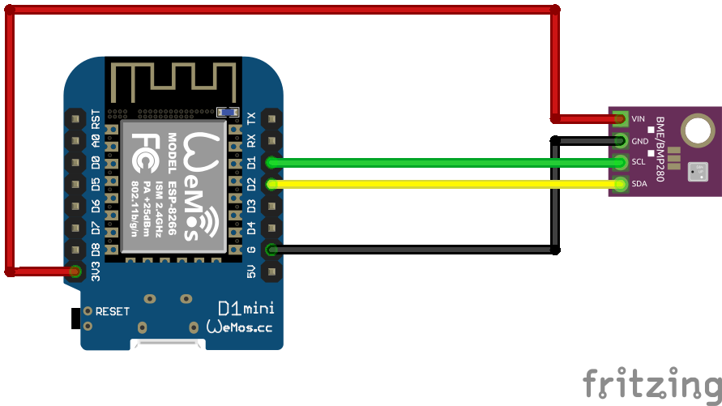

# BME280 Sensor
Auf Basis von [ESPHome](https://esphome.io/)

## Schaltplan


## Beispiel ausführen
```bash
esphome run bme280.yaml
```
## Kauflink
 * [AZDelivery](https://www.azdelivery.de/products/gy-bme280)
 * [BerryBase](https://www.berrybase.de/gy-bme280-breakout-board-3in1-sensor-fuer-temperatur-luftfeuchtigkeit-und-luftdruck)


## Dokumentation
[ESPHome BMP280](https://esphome.io/components/sensor/bme280.html)