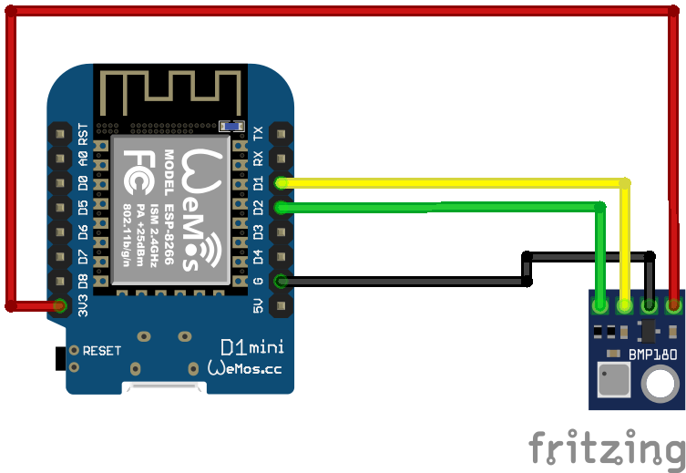

# BMP180 Sensor
Auf Basis von [ESPHome](https://esphome.io/)

## Schaltplan


## Beispiel ausführen
```bash
esphome run bmp180.yaml
```
## Kauflink
* [AZDelivery](https://www.az-delivery.de/products/azdelivery-gy-68-bmp180-barometrischer-sensor-luftdruck-modul-fur-arduino-und-raspberry-pi)
 * [Amazon](https://www.amazon.de/AZDelivery-BMP180-Barometrischer-Sensor-Luftdruck/dp/B07FRW7YTK)
 * [Aliexpress](https://de.aliexpress.com/item/32228095913.html)


## Dokumentation
[ESPHome BMP180](https://esphome.io/components/sensor/bmp085.html)