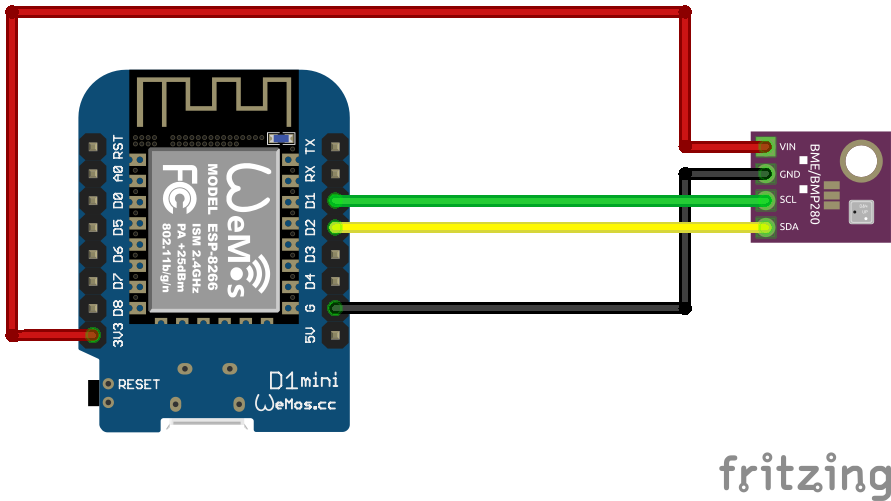

# BMP180 Sensor
Auf Basis von [ESPHome](https://esphome.io/)

## Schaltplan


## Beispiel ausführen
```bash
esphome run bmp280.yaml
```
## Kauflink
 * [AZDelivery](https://www.azdelivery.de/products/azdelivery-bmp280-barometrischer-sensor-luftdruck-modul-fur-arduino-und-raspberry-pi)
 * [Amazon](https://www.amazon.de/AZDelivery-GY-BMP280-Barometrischer-Sensor-Luftdruckmessung/dp/B07FS3QQFH)
 * [Aliexpress](https://de.aliexpress.com/item/32228095913.html)


## Dokumentation
[ESPHome BMP280](https://esphome.io/components/sensor/bmp280.html)