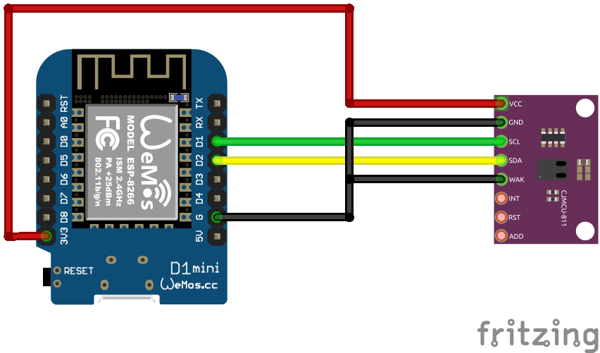

# CCS811 Sensor
Auf Basis von [ESPHome](https://esphome.io/)

## Schaltplan


## Beispiel ausführen
```bash
esphome run ccs811.yaml
```
## Kauflink
 * [BerryBase](https://www.berrybase.de/ccs811-luftqualitaets-sensor-mit-breakout-board)


## Dokumentation
[ESPHome CCS811](https://esphome.io/components/sensor/ccs811.html)