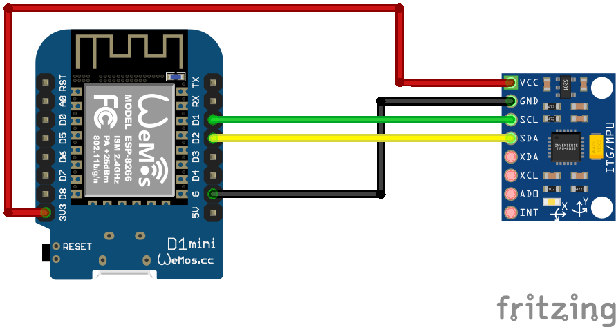

# BMP180 Sensor
Auf Basis von [ESPHome](https://esphome.io/)

## Schaltplan


## Beispiel ausführen
```bash
esphome run mpu6050.yaml
```
## Kauflink
* [AZDelivery](https://www.az-delivery.de/products/gy-521-6-achsen-gyroskop-und-beschleunigungssensor)
 * [Amazon](https://www.amazon.de/MPU-6050-3-Achsen-Beschleunigungsmesser-Gyroskop-Sensor-Modul-AD-Konverter-Datenausgang/dp/B07RXQGGJX)
 * [Aliexpress](https://de.aliexpress.com/item/1536997165.html)


## Dokumentation
[ESPHome MPU6050](https://esphome.io/components/sensor/mpu6050.html)