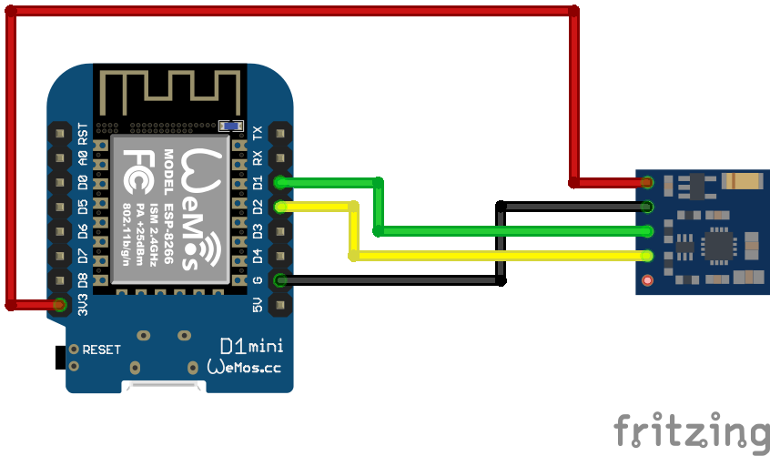

# BMP180 Senosr
Auf Basis von [ESPHome](https://esphome.io/)

## Schaltplan


## Beispiel ausführen
```bash
esphome run qmc5883l.yaml
```
## Kauflink
* [AZDelivery](https://www.az-delivery.de/products/gy-271-kompassmodul-kompass-magnet-sensor-fuer-arduino-und-raspberry-pi)
 * [Amazon](https://www.amazon.de/AZDelivery-Kompassmodul-Kompass-Arduino-Raspberry/dp/B07QGTY9DH)
 * [Aliexpress](https://de.aliexpress.com/item/1005001841074198.html)


## Dokumentation
[ESPHome QMC5883L](https://esphome.io/components/sensor/qmc5883l.html)