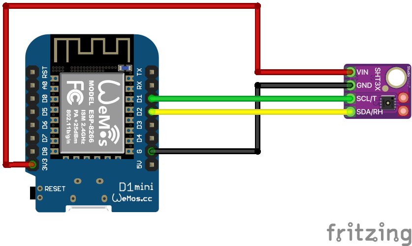

# SHT30 Sensor
Auf Basis von [ESPHome](https://esphome.io/)

## Schaltplan


## Beispiel ausführen
```bash
esphome run sht30.yaml
```
## Kauflink
 * [Amazon](https://www.amazon.de/DollaTek-SHT30-D-Temperatur-Luftfeuchtigkeit-Breakout/dp/B07HBPV4D6)


## Dokumentation
[ESPHome SHT30](https://esphome.io/components/sensor/sht3xd.html)