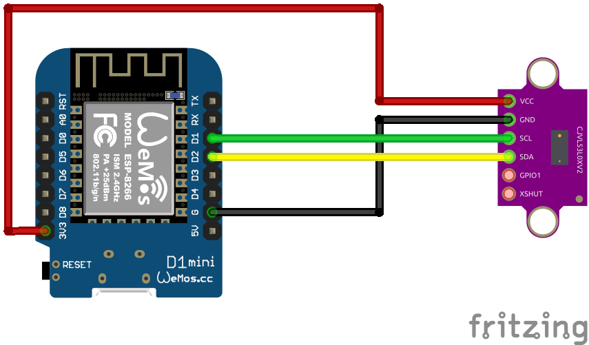

# VL53L0X Sensor
Auf Basis von [ESPHome](https://esphome.io/)

## Schaltplan


## Beispiel ausführen
```bash
esphome run vl53l0x.yaml
```
## Kauflink
* [AZDelivery](https://www.az-delivery.de/products/vl53l0x-time-of-flight-tof-laser-abstandssensor)
 * [Amazon](https://www.amazon.de/AZDelivery-VL53L0X-Flight-kompatibel-Arduino/dp/B086V37JJ7)
 * [Aliexpress](https://de.aliexpress.com/item/32853594094.html)


## Dokumentation
[ESPHome VL53L0X](https://esphome.io/components/sensor/vl53l0x.html)